# 📐 Arquitetura do Sistema — EntomoVigilância (Entomonitec)

> **Documentação Arquitetural Completa** com diagramas Mermaid  
> Gerada seguindo as regras de `.cursor/rules/` (base, code-standards, lgpd, security)  
> Versão: 2.1.1+a | Última atualização: Março 2026

---

## Sumário

1. [Visão Geral do Sistema](#1-visão-geral-do-sistema)
2. [Stack Tecnológico](#2-stack-tecnológico)
3. [Arquitetura de Alto Nível](#3-arquitetura-de-alto-nível)
4. [Estrutura de Pastas](#4-estrutura-de-pastas)
5. [Fluxo de Autenticação e Autorização](#5-fluxo-de-autenticação-e-autorização)
6. [Sistema de Roles (RBAC)](#6-sistema-de-roles-rbac)
7. [Multi-Tenancy e Isolamento de Dados](#7-multi-tenancy-e-isolamento-de-dados)
8. [Modelo de Dados (Firestore)](#8-modelo-de-dados-firestore)
9. [Fluxo de Visitas (Rotina e LIRAa)](#9-fluxo-de-visitas-rotina-e-liraa)
10. [Arquitetura de Serviços](#10-arquitetura-de-serviços)
11. [Hierarquia de Componentes](#11-hierarquia-de-componentes)
12. [Rotas e Navegação](#12-rotas-e-navegação)
13. [Conformidade LGPD](#13-conformidade-lgpd)
14. [Arquitetura de Segurança](#14-arquitetura-de-segurança)
15. [Fluxo de Convite de Usuários](#15-fluxo-de-convite-de-usuários)
16. [Sincronização Offline-First](#16-sincronização-offline-first)
17. [Pipeline de Upload de Fotos](#17-pipeline-de-upload-de-fotos)
18. [Arquitetura DevOps](#18-arquitetura-devops)
19. [Roadmap e Fases do Projeto](#19-roadmap-e-fases-do-projeto)

---

## 1. Visão Geral do Sistema

O **EntomoVigilância** é uma plataforma multi-tenant de vigilância entomológica para Secretarias Municipais de Saúde do Brasil. Permite a coleta, gestão e análise de dados de visitas de campo para controle de vetores (Aedes aegypti), seguindo os protocolos do Ministério da Saúde, incluindo o índice LIRAa.

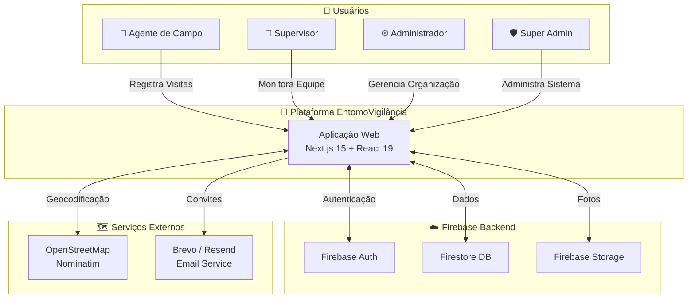

---

## 2. Stack Tecnológico

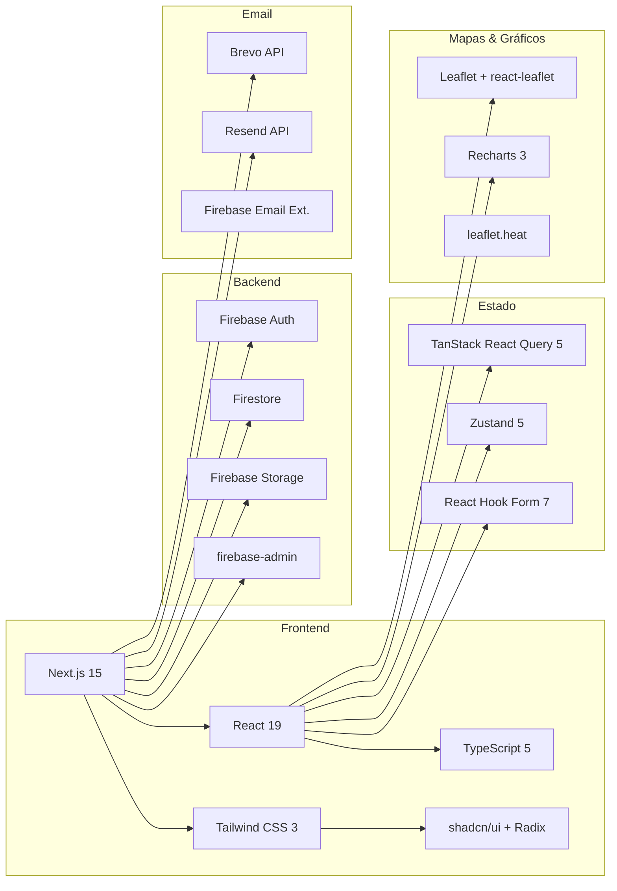

---

## 3. Arquitetura de Alto Nível

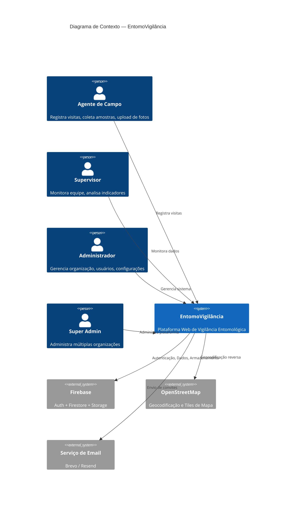

---

## 4. Estrutura de Pastas

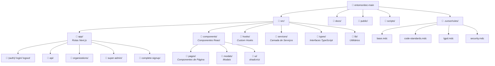

---

## 5. Fluxo de Autenticação e Autorização

### 5.1 Login

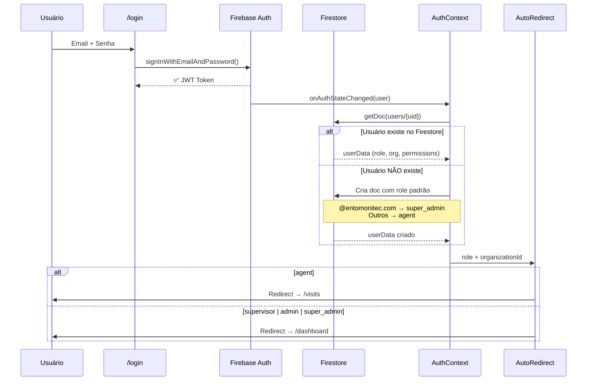

### 5.2 Guarda de Autenticação (useAuthGuard)

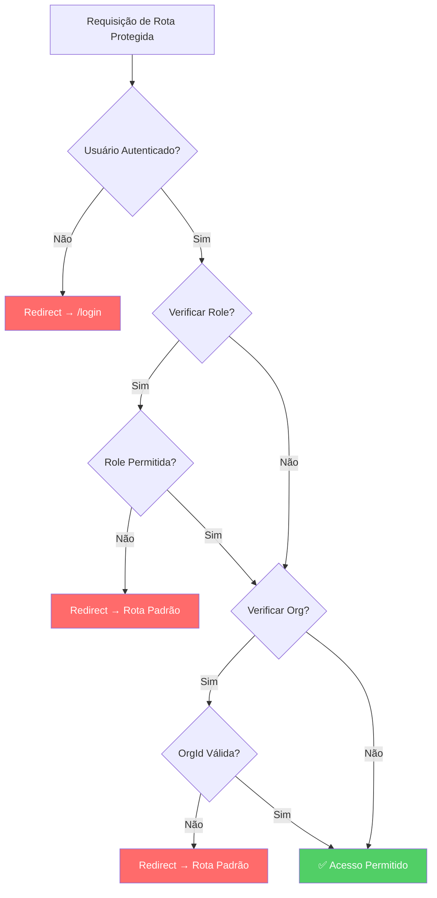

---

## 6. Sistema de Roles (RBAC)

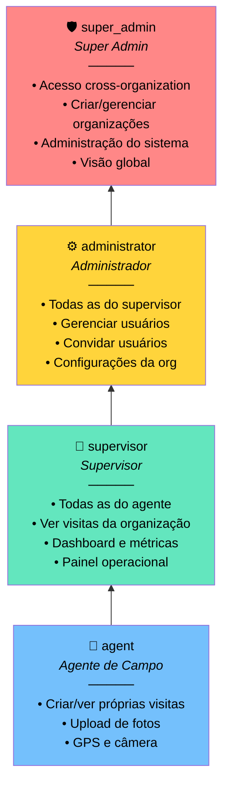

### Matriz de Acesso por Rota

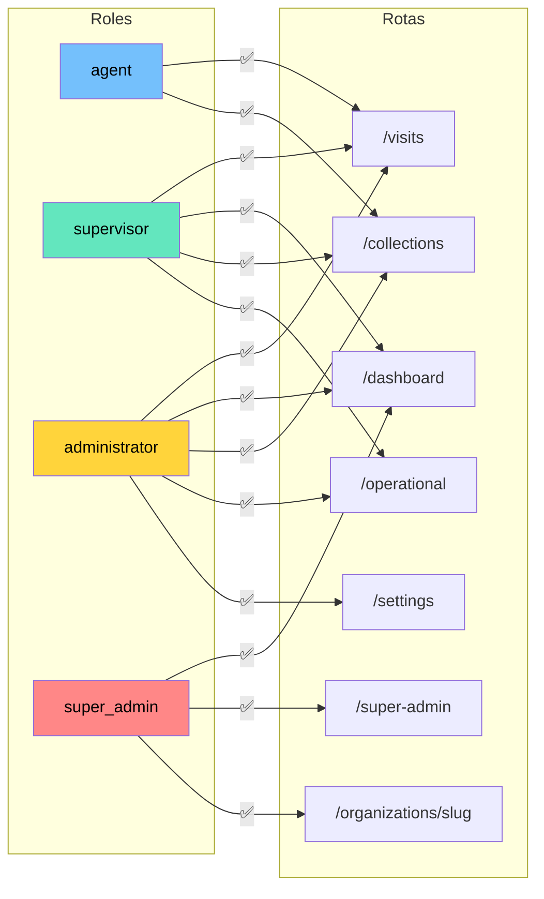

---

## 7. Multi-Tenancy e Isolamento de Dados

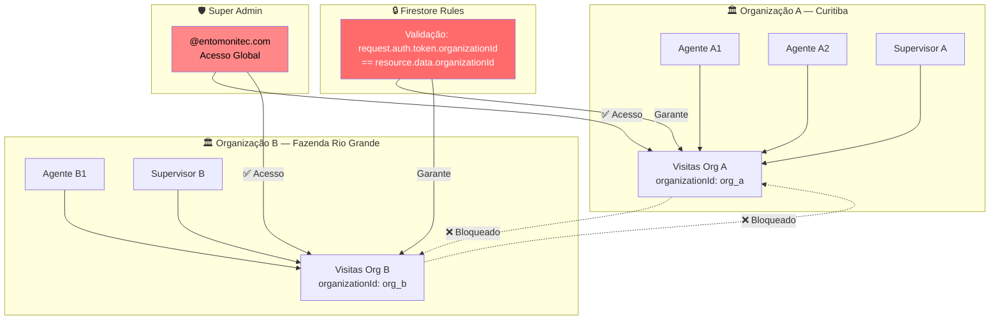

> **Regra `.cursor/rules/security.mdc`**: Isolamento total por organização. NUNCA permitir acesso cross-organization. SEMPRE validar `organizationId` nas queries.

---

## 8. Modelo de Dados (Firestore)

### 8.1 Diagrama ER

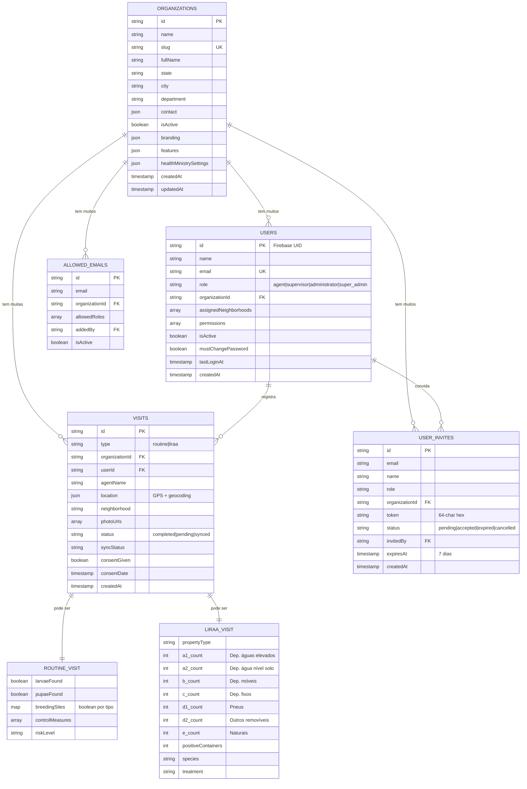

### 8.2 Políticas de Retenção (LGPD)

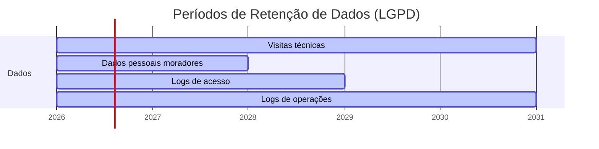

> **Regra `.cursor/rules/lgpd.mdc`**: Visitas técnicas: 5 anos. Dados pessoais moradores: 2 anos após última visita. Logs de acesso: 3 anos. Logs de operações: 5 anos.

---

## 9. Fluxo de Visitas (Rotina e LIRAa)

### 9.1 Criação de Visita

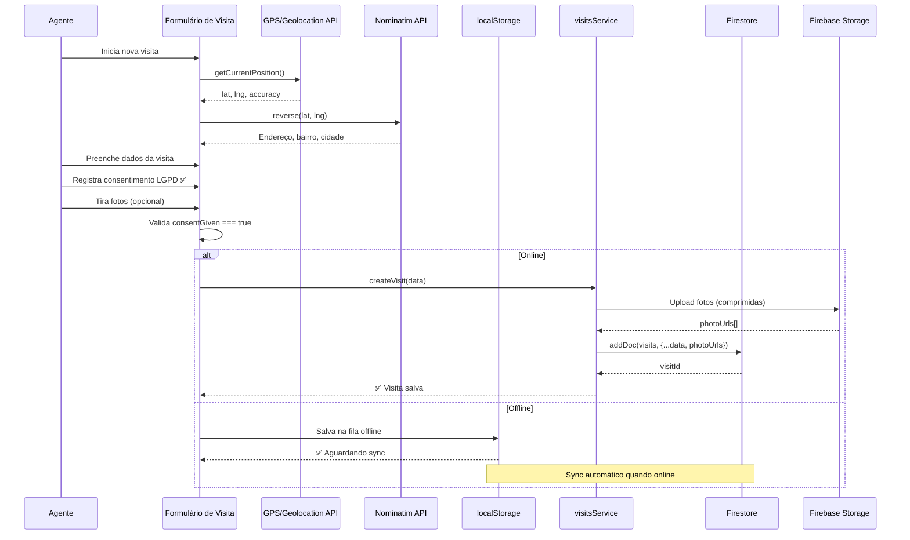

### 9.2 Tipos de Visita

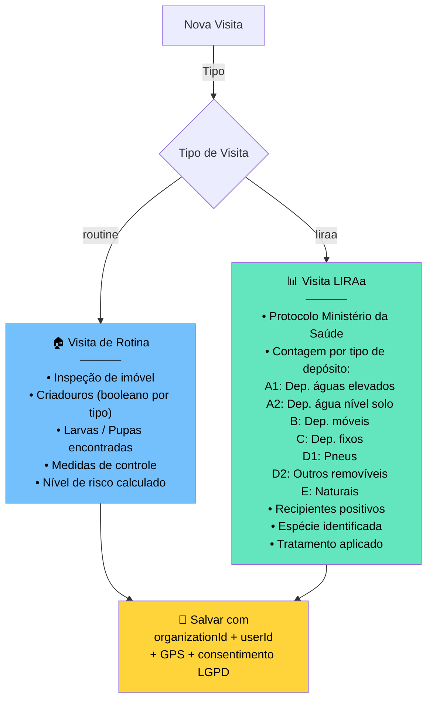

---

## 10. Arquitetura de Serviços

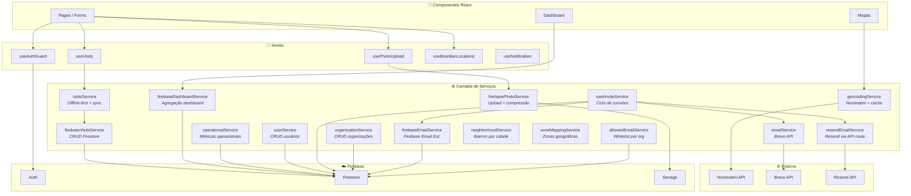

---

## 11. Hierarquia de Componentes

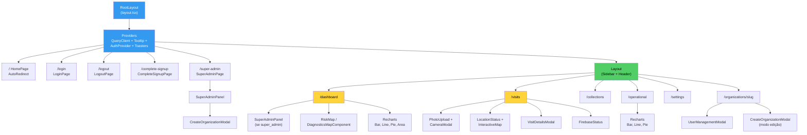

---

## 12. Rotas e Navegação

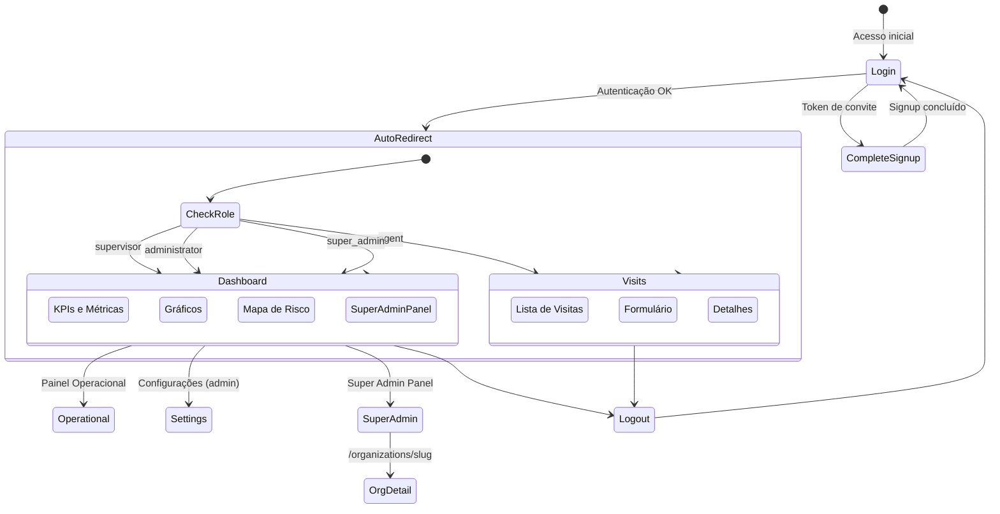

---

## 13. Conformidade LGPD

### 13.1 Fluxo de Consentimento

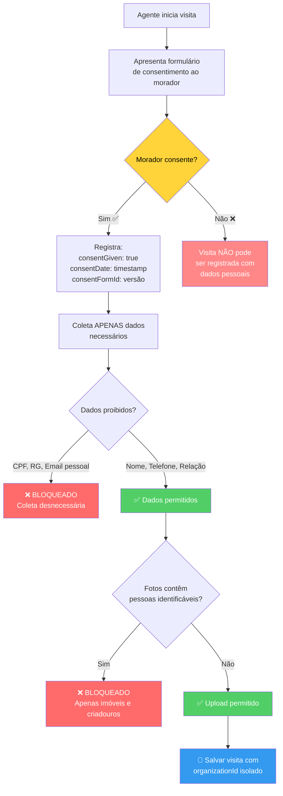

### 13.2 Dados do Morador (Interface Obrigatória)

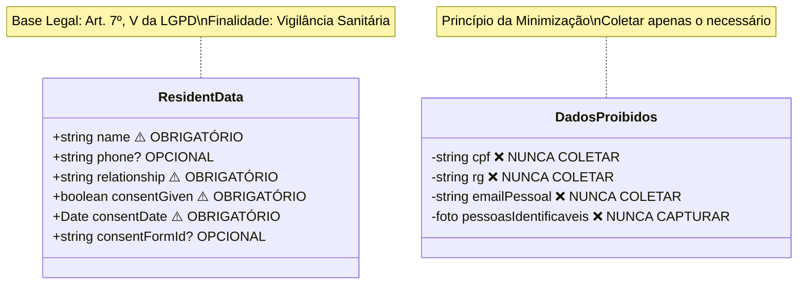

### 13.3 Direitos do Titular

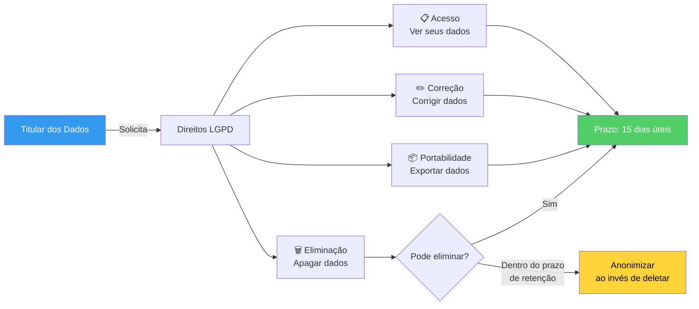

---

## 14. Arquitetura de Segurança

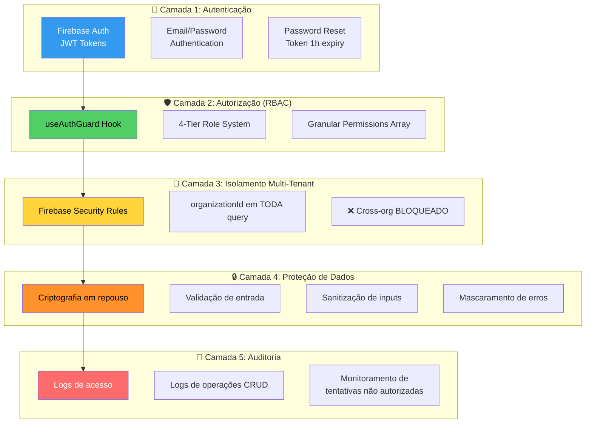

### Proibições de Segurança (`.cursor/rules/security.mdc`)

```mermaid
mindmap
  root((🚫 Proibições<br/>de Segurança))
    Dados
      NUNCA expor dados pessoais em logs
      NUNCA expor stack traces em produção
      NUNCA armazenar senhas em texto plano
      NUNCA confiar em dados do cliente sem validação
    Acesso
      NUNCA permitir acesso cross-organization
      NUNCA acessar rotas sem autenticação
      NUNCA ignorar validação de role
    API
      NUNCA expor API keys no cliente
      NUNCA retornar info sensível em erros
```

---

## 15. Fluxo de Convite de Usuários

```mermaid
sequenceDiagram
    participant AD as Admin
    participant UIS as UserInviteService
    participant FS as Firestore
    participant ES as EmailService
    participant API as /api/send-invite-email
    participant NV as Novo Usuário
    participant CS as /complete-signup
    participant FA as Firebase Auth

    AD->>UIS: Criar convite (email, name, role, orgId)
    UIS->>UIS: Gera token (64-char hex)
    UIS->>FS: Salva em user_invites<br/>status: pending, expiresAt: 7 dias

    alt Brevo (Primário)
        UIS->>ES: Envia email via Brevo API
    else Resend (Alternativo)
        UIS->>API: POST /api/send-invite-email
        API-->>NV: Email com link de convite
    else Firebase Email
        UIS->>FS: Escreve em collection 'mail'
    end

    ES-->>NV: 📧 Email com link:<br/>/complete-signup?token=xxx

    NV->>CS: Acessa link do convite
    CS->>FS: Valida token em user_invites
    FS-->>CS: ✅ Token válido + dados do convite

    NV->>CS: Define senha
    CS->>FA: createUserWithEmailAndPassword()
    FA-->>CS: ✅ Conta criada
    CS->>FS: Cria doc em 'users' com role/org do convite
    CS->>FS: Atualiza user_invites status: accepted

    CS->>NV: Redirect → /login
    NV->>NV: Login com nova conta
```

---

## 16. Sincronização Offline-First

```mermaid
stateDiagram-v2
    [*] --> Online: App iniciada

    state Online {
        [*] --> CriarVisita
        CriarVisita --> SalvarFirestore: Conectado
        SalvarFirestore --> VisitaSalva
    }

    state Offline {
        [*] --> CriarVisitaLocal
        CriarVisitaLocal --> SalvarLocalStorage: Sem conexão
        SalvarLocalStorage --> FilaSync: Adicionado à fila
    }

    Online --> Offline: Perda de conexão
    Offline --> Sincronizando: Conexão restaurada

    state Sincronizando {
        [*] --> LerFila
        LerFila --> EnviarPendentes: Para cada item
        EnviarPendentes --> UploadFotos
        UploadFotos --> SalvarFirestore2
        SalvarFirestore2 --> LimparFila
        LimparFila --> [*]
    }

    Sincronizando --> Online: Fila vazia
```

```mermaid
flowchart LR
    A[Visita Criada] --> B{Online?}
    B -->|Sim| C[Firebase Firestore<br/>+ Storage]
    B -->|Não| D[localStorage<br/>Queue]
    D --> E{Conexão<br/>restaurada?}
    E -->|Sim| F[Sync automático]
    F --> C
    E -->|Não| D

    C --> G[✅ syncStatus: synced]
    D --> H[⏳ syncStatus: pending]

    style C fill:#51cf66,color:#000
    style D fill:#ffd43b,color:#000
    style H fill:#ff922b,color:#000
```

---

## 17. Pipeline de Upload de Fotos

```mermaid
flowchart TD
    A[📷 Agente captura foto] --> B{Tipo válido?<br/>JPEG/PNG/WebP}
    B -->|Não| C[❌ Tipo rejeitado]
    B -->|Sim| D{Tamanho ≤ 5MB?}
    D -->|Não| E[❌ Arquivo muito grande]
    D -->|Sim| F[🔄 Compressão via Canvas]

    F --> G[Redimensionar<br/>max 1920px]
    G --> H[Redução iterativa<br/>de qualidade]
    H --> I{Resultado ≤ 1MB?}
    I -->|Não| H
    I -->|Sim| J{Online?}

    J -->|Sim| K[☁️ Upload Firebase Storage<br/>com progresso]
    J -->|Não| L[💾 Armazena base64<br/>em localStorage]

    K --> M[📎 photoUrl retornada]
    L --> N[⏳ Upload quando online]

    style C fill:#ff6b6b,color:#fff
    style E fill:#ff6b6b,color:#fff
    style M fill:#51cf66,color:#000
    style N fill:#ffd43b,color:#000
```

> **Regra `.cursor/rules/security.mdc`**: NUNCA fotografar pessoas identificáveis — apenas imóveis e criadouros. Validar tipos de arquivo antes de upload.

---

## 18. Arquitetura DevOps

```mermaid
graph TB
    subgraph "🔨 Desenvolvimento"
        DEV[next dev -H 0.0.0.0]
        NGROK[ngrok tunnel<br/>Dev mobile]
        CERTS[Certificados HTTPS<br/>locais]
    end

    subgraph "🚀 Deploy"
        VERCEL[Vercel<br/>Hosting Next.js]
        SSL[SSL/TLS<br/>Let's Encrypt]
    end

    subgraph "☁️ Firebase (Produção)"
        FP[entomonitec<br/>Firebase Project]
        FAUTH[Firebase Auth]
        FFS[Firestore]
        FST[Firebase Storage]
    end

    subgraph "🌐 DNS (Planejado)"
        DDEV[dev.entomonitec.com.br]
        DHOM[homolog.entomonitec.com.br]
        DPROD[app.entomonitec.com.br]
    end

    subgraph "📊 Monitoramento (Planejado)"
        SENTRY[Sentry<br/>Error Tracking]
        VANALYTICS[Vercel Analytics]
        UPTIME[UptimeRobot<br/>Disponibilidade]
    end

    DEV --> VERCEL
    NGROK --> DEV
    VERCEL --> SSL
    VERCEL --> FP
    FP --> FAUTH
    FP --> FFS
    FP --> FST

    DDEV -.-> VERCEL
    DHOM -.-> VERCEL
    DPROD -.-> VERCEL

    VERCEL -.-> SENTRY
    VERCEL -.-> VANALYTICS
    VERCEL -.-> UPTIME

    style VERCEL fill:#339af0,color:#fff
    style FP fill:#ff922b,color:#000
```

### Ambientes Planejados

```mermaid
graph LR
    subgraph "DEV"
        D1[dev.entomonitec.com.br]
        D2[Firebase DEV Project]
        D3[Regras relaxadas]
    end

    subgraph "HOMOLOG"
        H1[homolog.entomonitec.com.br]
        H2[Firebase HOMOLOG Project]
        H3[Regras prod-like]
    end

    subgraph "PRODUÇÃO"
        P1[app.entomonitec.com.br]
        P2[Firebase PROD Project]
        P3[Regras rígidas]
    end

    D1 -->|Aprovação| H1
    H1 -->|Validação| P1

    style D1 fill:#74c0fc,color:#000
    style H1 fill:#ffd43b,color:#000
    style P1 fill:#51cf66,color:#000
```

---

## 19. Roadmap e Fases do Projeto

```mermaid
timeline
    title Roadmap EntomoVigilância
    
    section Fase 1 — MVP ✅
        2024-2025 : Auth Firebase + Login
                   : Visitas Rotina + LIRAa
                   : Dashboard com métricas
                   : Multi-tenancy
                   : Mapas Leaflet + GPS
                   : Upload de fotos
                   : Sistema de convites
                   : Sync offline-first

    section Fase 2 — Próximo 🔜
        2026 : Push notifications
             : Relatórios PDF
             : Gráficos interativos avançados
             : Integrações externas
             : Otimização de performance

    section Fase 3 — Futuro 🔮
        2026-2027 : Análise preditiva com IA
                  : Apps nativos iOS/Android
                  : Analytics avançados

    section Fase 4 — Escala 🚀
        2027+ : Caching + CDN
              : Auto-scaling
              : Conformidade LGPD completa
              : Disaster Recovery
              : Monitoramento 24/7
```

### Prioridades Atuais

```mermaid
quadrantChart
    title Matriz de Prioridade
    x-axis Baixo Esforço --> Alto Esforço
    y-axis Baixo Impacto --> Alto Impacto
    quadrant-1 Fazer Agora
    quadrant-2 Planejar
    quadrant-3 Delegar
    quadrant-4 Considerar
    Push Notifications: [0.3, 0.8]
    PDF Export: [0.4, 0.75]
    Performance Opt: [0.5, 0.7]
    Backups Auto: [0.35, 0.65]
    API Pública: [0.7, 0.6]
    App Mobile: [0.85, 0.9]
    IA Preditiva: [0.9, 0.8]
    CDN/Caching: [0.6, 0.5]
```

---

## Referências das Regras `.cursor/rules/`

| Arquivo | Escopo |
|---------|--------|
| `base.mdc` | Contexto do projeto, princípios gerais, conformidade LGPD, multi-tenancy, estrutura |
| `code-standards.mdc` | Padrões TypeScript, React/Next.js, Firebase, estrutura de dados, nomenclatura |
| `lgpd.mdc` | Coleta de dados, consentimento, segurança, direitos do titular, retenção |
| `security.mdc` | Autenticação, autorização, criptografia, auditoria, segurança mobile |

---

> **Documento gerado seguindo as diretrizes definidas em `.cursor/rules/`**  
> Base legal: Art. 7º, V da LGPD — interesse público em vigilância sanitária e controle de vetores
